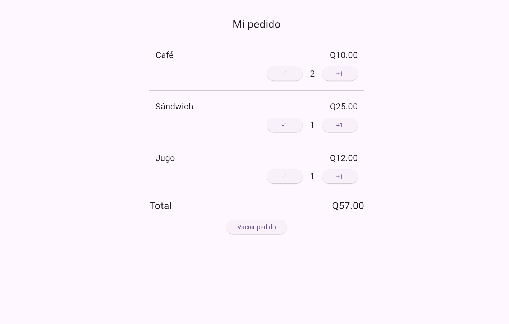

## ¿Cómo calcula el total y por qué conviene reutilizar ProductoPedido?

Multiplicando el precio de cada producto por su cantidad y después sumando los tres resultados, cuando se presiona un botón, cambio la cantidad con setState y la pantalla se actualiza con el nuevo total. Uso toStringAsFixed(2) para mostrar siempre dos decimales 

Reutilizar productoPedido me sirve para no escribir lo mismo tres veces, le paso el nombre, precio, cantidad y las acciones de los botones. Así los tres productos tienen el mismo diseño y, si quiero cambiar cómo se ven, solo modifico esa función.

## Pedido de Q57.00

